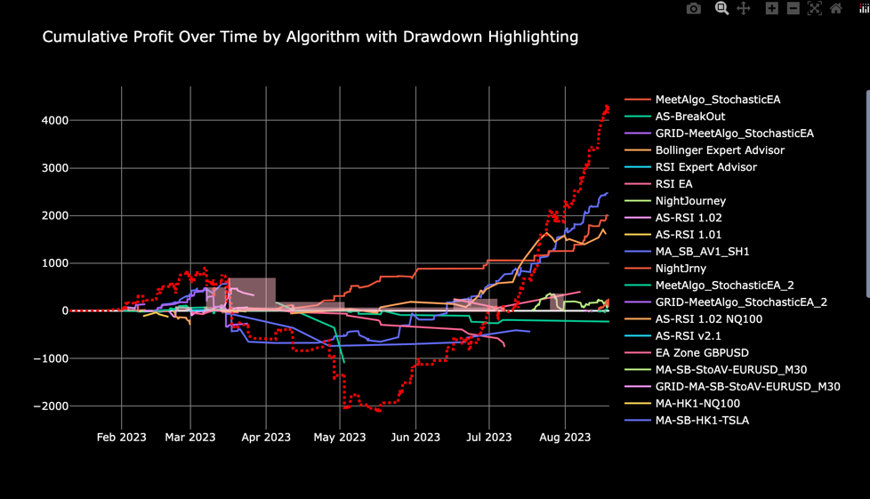
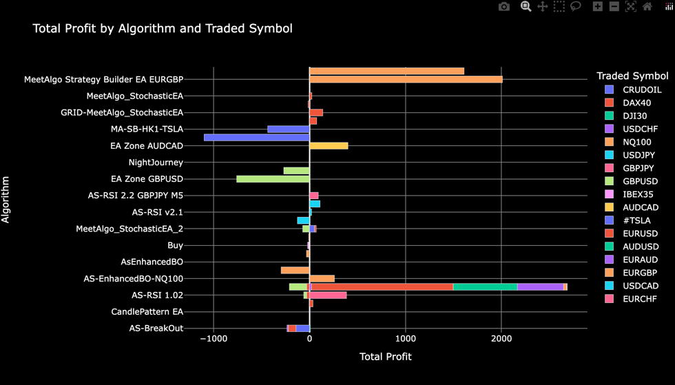
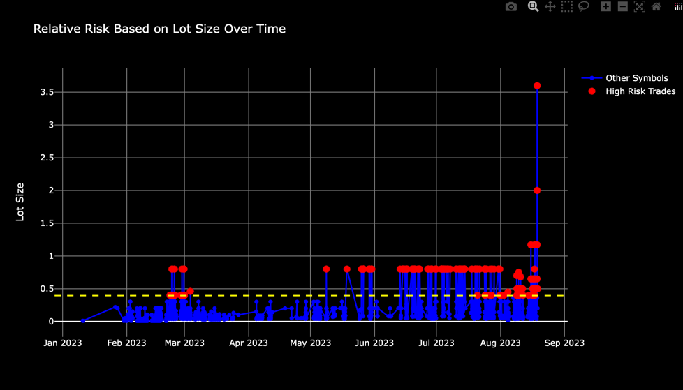
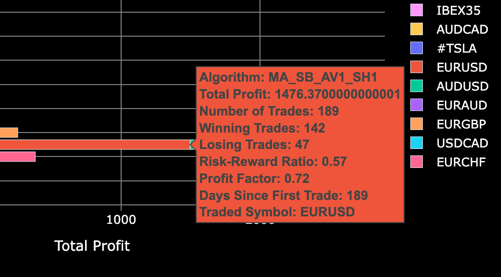

# Trading Algorithm Analysis Tool

Analyze and visualize the performance of different trading algorithms using data exported from MetaTrader through the TradeVisExport "EA" (based on the TradeBuddy script by Rene Balke)

## Features:

- **Data Loading**: Easily load trading data from CSV files exported by the "TradeVisExport" or alternatively the classic "TradeBuddy" script.
- **Flexible Date Range**: Filter your trading data by a specific date range (n days back).
- **Algorithm Identification**: Automatically identify and map trading algorithms using magic numbers or comments.
- **Ignore Specific Symbols**: Define specific symbols or patterns to be excluded from the relative risk plot.
- **Performance Metrics**:
  - Total Profit by Algorithm and Traded Symbol
  - Maximum Drawdown by Algorithm
  - Cumulative Profit Over Time by Algorithm
  - Relative Risk Based on Lot Size Over Time (with special handling for shares)
- **Interactive Visualizations**: Gain insights with interactive plots powered by `plotly`.

  
(the screenshots above are from a demo test account and are not representative of the performance of the algorithms)

## Requirements:

- Python 3.x
- pandas
- plotly
- fnmatch (for pattern matching in the ignore filter)

## Usage:
### Exporting Data with TradeVisExport:
1. **Installation**: Place the TradeVisExport EA in your MetaTrader's Experts folder.
2. **Configuration**: Set up the TradeVisExport EA with your desired parameters, including the export period, file name, and any specific export conditions.
3. **Running the Export**: Activate the TradeVisExport EA on any chart in MetaTrader. The EA will export the trading data to a CSV file as configured.

### Analyzing data exported by "TradeVisExport":
To use the script, navigate to the directory containing the script and run the following command in the terminal or command prompt:

python script_name.py <data_file_path> <days_back> [--drawdown]

Where:
- `script_name.py` is the name of the Python script (rename it to your script's name).
- `<data_file_path>` is the path to the CSV data file exported by "tradeVisExport" or the classic "TradeBuddy".
- `<days_back>` is the number of days back to consider for the analysis.
- `--drawdown` is an optional flag to include the maximum drawdown areas in the output.

## Configuration:

To adapt the tool to different algorithms or to add new ones, modify the `ALGO_MAPPING_CONFIG` dictionary in the script. This dictionary allows you to map algorithm names to their respective magic numbers or comment patterns.

To exclude specific symbols from the relative risk plot, modify the `IGNORE_FILTER` list in the script.

## Visualizations:

The script provides the following visualizations:

1. **Total Profit by Algorithm and Traded Symbol**: A bar chart displaying the total profit accumulated by each algorithm, broken down by traded symbol.
2. **Cumulative Profit Over Time by Algorithm**: A line chart showcasing the cumulative profit over time, with each algorithm differentiated by color. There's also a combined line showing the cumulative profit of all algorithms together.
3. **Relative Risk Based on Lot Size Over Time**: A line chart displaying the relative risk based on lot size, with special handling for shares and the ability to exclude specific symbols.

## Acknowledgement:

The export tool was originally inspired by the "TradeBuddy" script developed by Rene Balke and has been updated with a custom exporter, TradeVisExport, for automatic export.

This is not a finished product and is provided as-is. Feel free to modify it to suit your needs. Let me know if you made some useful changes and I'll be happy to merge them into the main branch.
