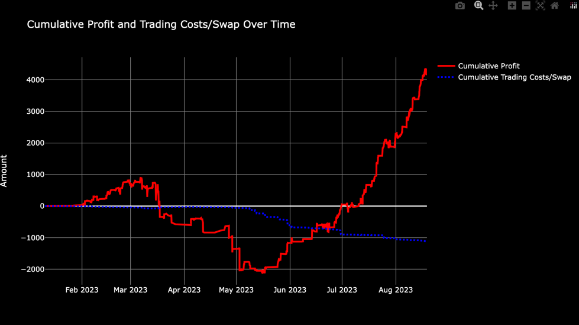

# Trading Algorithm Analysis Tool

Analyze and visualize the performance of different trading algorithms using data exported from MetaTrader through the "TradeBuddy" script by Rene Balke.

## Features:

- **Data Loading**: Easily load trading data from CSV files exported by the "TradeBuddy" script.
- **Flexible Date Range**: Filter your trading data by a specific date range (n days back).
- **Algorithm Identification**: Automatically identify and map trading algorithms using magic numbers or comments.
- **Ignore Specific Symbols**: Define specific symbols or patterns to be excluded from the relative risk plot.
- **Performance Metrics**:
  - Total Profit by Algorithm and Traded Symbol
  - Maximum Drawdown by Algorithm
  - Cumulative Profit Over Time by Algorithm
  - Relative Risk Based on Lot Size Over Time (with special handling for shares)
- **Interactive Visualizations**: Gain insights with interactive plots powered by `plotly`.

(the screenshots above are from a demo test account and are not representative of the performance of the algorithms)

## Requirements:

- Python 3.x
- pandas
- plotly
- fnmatch (for pattern matching in the ignore filter)

## Usage:

To use the script, navigate to the directory containing the script and run the following command in the terminal or command prompt:

python script_name.py <data_file_path> <days_back> [--drawdown]

Where:
- `script_name.py` is the name of the Python script (rename it to your script's name).
- `<data_file_path>` is the path to the CSV data file exported by "TradeBuddy".
- `<days_back>` is the number of days back to consider for the analysis.
- `--drawdown` is an optional flag to include the maximum drawdown in the output.

## Configuration:

To adapt the tool to different algorithms or to add new ones, modify the `ALGO_MAPPING_CONFIG` dictionary in the script. This dictionary allows you to map algorithm names to their respective magic numbers or comment patterns.

To exclude specific symbols from the relative risk plot, modify the `IGNORE_FILTER` list in the script.

## Visualizations:

The script provides the following visualizations:

1. **Total Profit by Algorithm and Traded Symbol**: A bar chart displaying the total profit accumulated by each algorithm, broken down by traded symbol.
2. **Cumulative Profit Over Time by Algorithm**: A line chart showcasing the cumulative profit over time, with each algorithm differentiated by color. There's also a combined line showing the cumulative profit of all algorithms together.
3. **Relative Risk Based on Lot Size Over Time**: A line chart displaying the relative risk based on lot size, with special handling for shares and the ability to exclude specific symbols.

## Acknowledgement:

This tool utilizes trading data exported from MetaTrader using the "TradeBuddy" script developed by Rene Balke.
It could be easily adapted to work with other trading data in CSV format.

This is not a finished product and is provided as-is. Feel free to modify it to suit your needs. Let me know if you made some useful changes and I'll be happy to merge them into the main branch.
